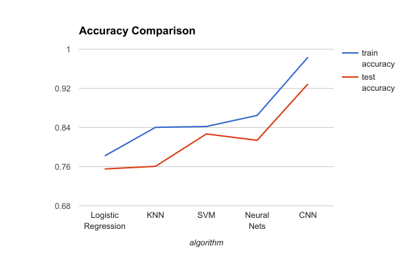

Handwritten Character Prediction
================================

>Predict the lowercase letters a-z from their binary images. 
>The training and test data are provided as sequences of images 
>where each sequence is extracted from a handwritten word

##Kaggle
The competition has been hosted on Kaggle and can be accessed through following url : https://kaggle.com/join/cs5339predictioncompetition. 

##Training & Testing Data
The training and test data for the competition can be accessed from the data file folder.

##Grading
A: accuracy >= 90%
B: 80% <= accuracy < 90%
C: 70% <= accuracy < 80%
D: 60% <= accuracy < 70%
E: 50% <= accuracy < 60%
F: accuracy < 50%

##Algorithm Performance Comparison

| algorithm |train accuracy|test accuracy|
| :------:| :------: | :------: |
|LRreg|0.78197|0.75534|
|KNN|	0.84036	|0.76075|
|SVM	|0.84206|	0.82684|
|NN|	0.86468|	0.81389|
|CNN	|0.98351	|0.92897|

